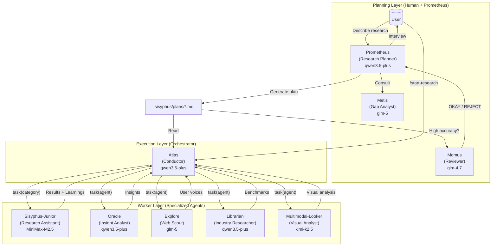
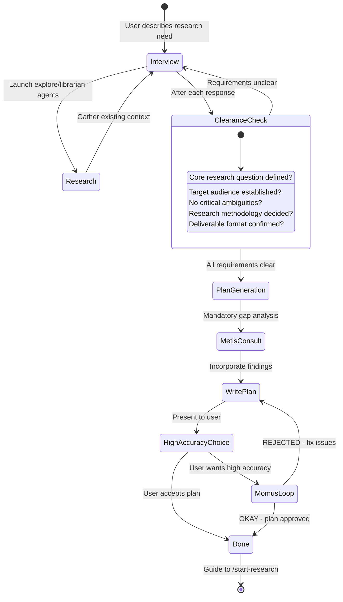
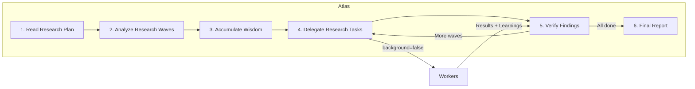

# Orchestration System Guide

Oh My OpenBusiness's orchestration system transforms a simple AI agent into a coordinated UX research team through **separation of research planning and execution**.

---

## TL;DR - When to Use What

| Complexity            | Approach                  | When to Use                                                                              |
| --------------------- | ------------------------- | ---------------------------------------------------------------------------------------- |
| **Simple**            | Just prompt               | Simple lookups, quick source checks, single-source queries                               |
| **Complex + Lazy**    | Type `ulw` or `ultrawork` | Complex research where explaining context is tedious. Agent figures it out.              |
| **Complex + Precise** | `@plan` → `/start-research` | Precise, multi-step research requiring true orchestration. Prometheus plans, Atlas executes. |

**Decision Flow:**

```
Is it a quick lookup or simple query?
  └─ YES → Just prompt normally
  └─ NO  → Is explaining the full research context tedious?
              └─ YES → Type "ulw" and let the agent figure it out
              └─ NO  → Do you need precise, verifiable research?
                         └─ YES → Use @plan for Prometheus planning, then /start-research
                         └─ NO  → Just use "ulw"
```

---

## The Architecture

The orchestration system uses a three-layer architecture that solves context overload, cognitive drift, and verification gaps through specialization and delegation.



---

## Planning: Prometheus + Metis + Momus

### Prometheus: Your Research Consultant

Prometheus is not just a planner, it's an intelligent interviewer that helps you think through what you actually need to know. It is **READ-ONLY** — can only create or modify markdown files within `.sisyphus/` directory.

**The Interview Process:**



**Intent-Specific Strategies:**

Prometheus adapts its interview style based on what type of research you're doing:

| Intent                 | Prometheus Focus               | Example Questions                                          |
| ---------------------- | ------------------------------ | ---------------------------------------------------------- |
| **Discovery**          | Breadth — source mapping       | "What user segments exist?" "Where do they talk online?"   |
| **Evaluation**         | Depth — pattern identification | "What specific pain points?" "How severe are they?"        |
| **Competitive**        | Comparison — feature mapping   | "Who are the competitors?" "What do users say about them?" |
| **Synthesis**          | Integration — insight generation | "What patterns exist across sources?" "What contradicts?"  |

### Metis: The Gap Analyzer

Before Prometheus writes the research plan, Metis catches what Prometheus missed:

- Hidden assumptions in the research question
- Ambiguities that could derail findings
- AI-slop patterns (over-generalization, unsupported claims, scope creep)
- Missing acceptance criteria for research quality
- Edge cases not addressed (user segments, platforms, regions)

**Why Metis Exists:**

The plan author (Prometheus) has "ADHD working memory" — it makes connections that never make it onto the page. Metis forces externalization of implicit knowledge.

### Momus: The Ruthless Reviewer

For high-accuracy mode, Momus validates research plans against four core criteria:

1. **Clarity**: Does each research wave specify WHERE to find data?
2. **Verification**: Are success criteria concrete and measurable?
3. **Context**: Is there sufficient context to proceed without >10% guesswork?
4. **Big Picture**: Is the research purpose, background, and workflow clear?

**The Momus Loop:**

Momus only says "OKAY" when:

- 100% of source references verified
- ≥80% of research waves have clear source strategies
- ≥90% of waves have concrete success criteria
- Zero waves require assumptions about user behavior
- Zero critical red flags

If REJECTED, Prometheus fixes issues and resubmits. No maximum retry limit.

---

## Execution: Atlas

### The Conductor Mindset

Atlas is like an orchestra conductor: it doesn't play instruments, it ensures perfect harmony.



**What Atlas CAN do:**

- Read files to understand research context
- Run commands to verify findings
- Check evidence quality and triangulation
- Search patterns across sources

**What Atlas MUST delegate:**

- Web scraping and social listening
- Sentiment analysis and thematic coding
- Persona and journey map creation
- Competitive analysis

### Wisdom Accumulation

The power of orchestration is cumulative learning. After each research wave:

1. Extract learnings from subagent's response
2. Categorize into: Conventions, Successes, Failures, Gotchas, Commands
3. Pass forward to ALL subsequent subagents

This prevents repeating mistakes and ensures consistent research patterns.

**Notepad System:**

```
.sisyphus/notepads/{research-name}/
├── learnings.md      # Patterns, conventions, successful approaches
├── decisions.md      # Research choices and rationales
├── issues.md         # Problems, blockers, gotchas encountered
├── verification.md   # Evidence validation outcomes
└── problems.md       # Unresolved issues, research gaps
```

---

## Workers: Sisyphus-Junior and Specialists

### Sisyphus-Junior: The Research Assistant

Junior is the workhorse that actually executes research tasks. Key characteristics:

- **Focused**: Cannot delegate (blocked from task tool)
- **Disciplined**: Obsessive todo tracking
- **Verified**: Must pass evidence checks before completion
- **Constrained**: Cannot modify research plan files (READ-ONLY)

**Why MiniMax M2.5 is Sufficient:**

Junior doesn't need to be the smartest — it needs to be reliable. With:

1. Detailed prompts from Atlas (50-200 lines)
2. Accumulated wisdom passed forward
3. Clear MUST DO / MUST NOT DO constraints
4. Verification requirements

Even a mid-tier model executes precisely. The intelligence is in the **system**, not individual agents.

### System Reminder Mechanism

The hook system ensures Junior never stops halfway:

```
[SYSTEM REMINDER - TODO CONTINUATION]

You have incomplete research todos! Complete ALL before responding:
- [ ] Scan Reddit for checkout complaints ← IN PROGRESS
- [ ] Analyze sentiment patterns
- [ ] Cross-validate with forum data

DO NOT respond until all todos are marked completed.
```

This "boulder pushing" mechanism is why the system is named after Sisyphus.

---

## Category + Skill System

### Why Categories are Revolutionary

**The Problem with Model Names:**

```typescript
// OLD: Model name creates distributional bias
task({ agent: "qwen3.5-plus", prompt: "..." }); // Model knows its limitations
task({ agent: "glm-5", prompt: "..." }); // Different self-perception
```

**The Solution: Semantic Categories:**

```typescript
// NEW: Category describes INTENT, not implementation
task({ category: "thematic-analysis", prompt: "..." }); // "Identify patterns"
task({ category: "visual-audit", prompt: "..." }); // "Evaluate visually"
task({ category: "quick-lookup", prompt: "..." }); // "Just find it fast"
```

### Built-in Categories

| Category             | Model                  | When to Use                                                 |
| -------------------- | ---------------------- | ----------------------------------------------------------- |
| `visual-audit` | Kimi K2.5         | Heuristic evaluation, visual analysis, accessibility         |
| `thematic-analysis` | GLM-5        | Pattern identification, qualitative coding      |
| `deep-research` | Kimi K2.5 | In-depth investigation, thorough exploration |
| `creative-insights` | Qwen3.5 Plus         | Creative analysis, ideation, novel connections              |
| `quick-lookup` | MiniMax M2.5           | Trivial tasks — single source checks, fast facts             |
| `content-coding` | GLM-5 | Qualitative data coding, sentiment classification |
| `report-writing` | Kimi K2.5         | Research report generation, documentation                     |
| `comprehensive-study` | Qwen3.5 Plus (max)  | Full research studies, multi-source synthesis          |

### Skills: Domain-Specific Instructions

Skills prepend specialized instructions to subagent prompts:

```typescript
// Category + Skill combination
task(
  category = "visual-audit",
  load_skills = ["ux-heuristics"], // Adds Nielsen heuristic expertise
  prompt = "...",
);

task(
  category = "deep-research",
  load_skills = ["social-listener"], // Adds social media monitoring expertise
  prompt = "...",
);
```

---

## Usage Patterns

### How to Invoke Prometheus

**Method 1: Switch to Prometheus Agent (Tab → Select Prometheus)**

```
1. Press Tab at the prompt
2. Select "Prometheus" from the agent list
3. Describe your research: "I want to understand checkout abandonment"
4. Answer interview questions
5. Prometheus creates research plan in .sisyphus/plans/{name}.md
```

**Method 2: Use @plan Command (in Sisyphus)**

```
1. Stay in Sisyphus (default agent)
2. Type: @plan "I want to understand checkout abandonment"
3. The @plan command automatically switches to Prometheus
4. Answer interview questions
5. Prometheus creates research plan in .sisyphus/plans/{name}.md
```

**Which Should You Use?**

| Scenario                          | Recommended Method         | Why                                                  |
| --------------------------------- | -------------------------- | ---------------------------------------------------- |
| **New session, starting fresh**   | Switch to Prometheus agent | Clean mental model — you're entering "planning mode" |
| **Already in Sisyphus, mid-work** | Use @plan                  | Convenient, no agent switch needed                   |
| **Want explicit control**         | Switch to Prometheus agent | Clear separation of planning vs execution contexts   |
| **Quick planning interrupt**      | Use @plan                  | Fastest path from current context                    |

Both methods trigger the same Prometheus planning flow. The @plan command is simply a convenience shortcut.

### /start-research Behavior and Session Continuity

**What Happens When You Run /start-research:**

```
User: /start-research
    ↓
[start-research hook activates]
    ↓
Check: Does .sisyphus/boulder.json exist?
    ↓
    ├─ YES (existing research) → RESUME MODE
    │   - Read the existing boulder state
    │   - Calculate progress (checked vs unchecked boxes)
    │   - Inject continuation prompt with remaining tasks
    │   - Atlas continues where you left off
    │
    └─ NO (fresh start) → INIT MODE
        - Find the most recent plan in .sisyphus/plans/
        - Create new boulder.json tracking this plan
        - Switch session agent to Atlas
        - Begin execution from research wave 1
```

**Session Continuity Explained:**

The `boulder.json` file tracks:

- **active_plan**: Path to the current research plan file
- **session_ids**: All sessions that have worked on this research
- **started_at**: When research began
- **plan_name**: Human-readable research plan identifier

**Example Timeline:**

```
Monday 9:00 AM
  └─ @plan "Research checkout abandonment"
  └─ Prometheus interviews and creates research plan
  └─ User: /start-research
  └─ Atlas begins execution, creates boulder.json
  └─ Wave 1 complete, Wave 2 in progress...
  └─ [Session ends — computer crash, user logout, etc.]

Monday 2:00 PM (NEW SESSION)
  └─ User opens new session (agent = Sisyphus by default)
  └─ User: /start-research
  └─ [start-research hook reads boulder.json]
  └─ "Resuming 'Research checkout abandonment' — 3 of 8 waves complete"
  └─ Atlas continues from Wave 3 (no context lost)
```

Atlas is automatically activated when you run `/start-research`. You don't need to manually switch to Atlas.

### Hephaestus vs Sisyphus + ultrawork

**Quick Comparison:**

| Aspect          | Hephaestus                                 | Sisyphus + `ulw` / `ultrawork`                       |
| --------------- | ------------------------------------------ | ---------------------------------------------------- |
| **Model**       | GLM-5 (thinking enabled)                   | Qwen3.5 Plus / GLM-5 / Kimi K2.5 depending on setup  |
| **Approach**    | Autonomous deep researcher                     | Keyword-activated ultrawork mode                       |
| **Best For**    | Complex research, deep reasoning | General complex tasks, "just do it" scenarios        |
| **Planning**    | Self-plans during execution                | Uses Prometheus plans if available                   |
| **Delegation**  | Heavy use of explore/librarian agents      | Uses category-based delegation                       |
| **Temperature** | 0.1                                        | 0.1                                                  |

**When to Use Hephaestus:**

Switch to Hephaestus (Tab → Select Hephaestus) when:

1. **Deep autonomous research needed**
   - "Research why users abandon our product"
   - "Find all pain points in the onboarding flow"

2. **Complex pattern detection requiring inference chains**
   - "What underlying motivations drive these complaints?"
   - "Connect sentiment patterns across 5 different platforms"

3. **Cross-domain knowledge synthesis**
   - "Combine social listening with industry benchmarks"
   - "Triangulate findings from reviews, forums, and analytics"

4. **You specifically want GLM-5 reasoning**
   - Some research problems benefit from GLM-5's particular strengths

**When to Use Sisyphus + `ulw`:**

Use the `ulw` keyword in Sisyphus when:

1. **You want the agent to figure it out**
   - "ulw find checkout complaints"
   - "ulw research competitor UX patterns"

2. **Complex but well-scoped research**
   - "ulw analyze sentiment around our new feature"
   - "ulw create personas from our user feedback"

3. **You're feeling lazy** (officially supported use case)
   - Don't want to write detailed research requirements
   - Trust the agent to explore and decide

4. **You want to leverage existing plans**
   - If a Prometheus research plan exists, `ulw` mode can use it
   - Falls back to autonomous exploration if no plan

**Recommendation:**

- **For most users**: Use `ulw` keyword in Sisyphus. It's the default path and works excellently for 90% of complex research tasks.
- **For power users**: Switch to Hephaestus when you specifically need GLM-5's reasoning style or want the fully autonomous exploration and execution experience.

---

## Configuration

You can control related features in `oh-my-openbusiness.jsonc`:

```jsonc
{
  "sisyphus_agent": {
    "disabled": false, // Enable Atlas orchestration (default: false)
    "planner_enabled": true, // Enable Prometheus (default: true)
    "replace_plan": true, // Replace default plan agent with Prometheus (default: true)
  },

  // Hook settings (add to disable)
  "disabled_hooks": [
    // "start-research",             // Disable execution trigger
    // "prometheus-md-only"      // Remove Prometheus write restrictions (not recommended)
  ],
}
```

---

## Troubleshooting

### "I switched to Prometheus but nothing happened"

Prometheus enters interview mode by default. It will ask you questions about your research requirements. Answer them, then say "make it a plan" when ready.

### "/start-research says 'no active plan found'"

Either:

- No plans exist in `.sisyphus/plans/` → Create one with Prometheus first
- Plans exist but boulder.json points elsewhere → Delete `.sisyphus/boulder.json` and retry

### "I'm in Atlas but I want to switch back to normal mode"

Type `exit` or start a new session. Atlas is primarily entered via `/start-research` — you don't typically "switch to Atlas" manually.

### "What's the difference between @plan and just switching to Prometheus?"

**Nothing functional.** Both invoke Prometheus. @plan is a convenience command while switching agents is explicit control. Use whichever feels natural.

### "Should I use Hephaestus or type ulw?"

**For most research tasks**: Type `ulw` in Sisyphus.

**Use Hephaestus when**: You specifically need GLM-5's reasoning style for deep autonomous research or complex pattern detection.

---

## Further Reading

- [Overview](./overview.md)
- [Features Reference](../reference/features.md)
- [Configuration Reference](../reference/configuration.md)
- [Manifesto](../manifesto.md)
